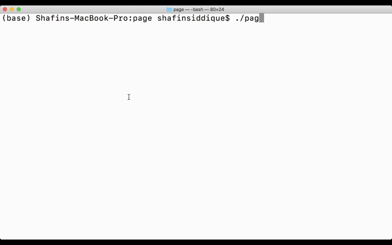

## Welcome to Page
### A Functional Programming Language Based on Lisp.
Page is heavily influenced by Racket. All parts of the interpreter are written from scratch in Go. 

### Program Examples
##### 1. Fibonacci

*Implementation of Fibonacci in Page.*

##### 2. Factorial

*Implementation of Factorial in Page.*

### Documentation

